# groupfinder_masking
A repo for checking how masking might change groupfinder results. 

## Intro
We take WAVES Wide as our example region, using the sharks mock catalog and the WAVES input catalog starmask. We aim to explore how a survey starmask may effect resulting group properties, and if biasing can occur. 

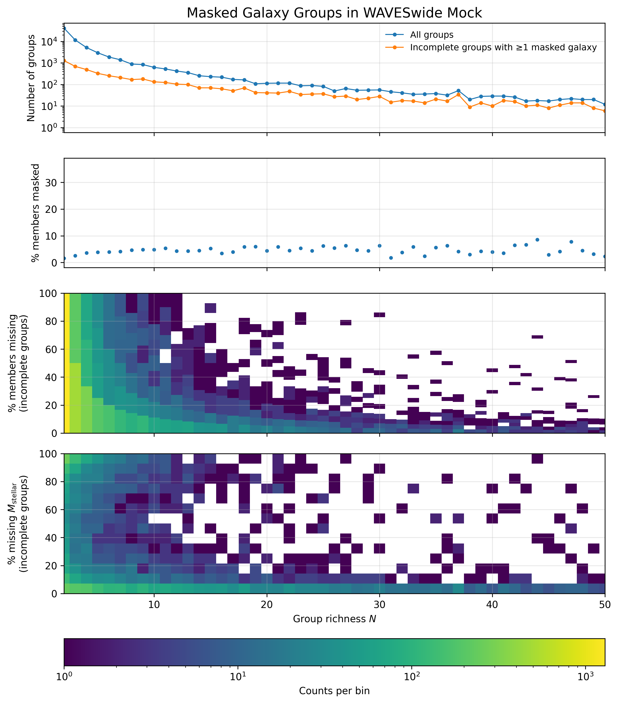

This plot shows how many groups are partially masked, and the extent of the masking. 

The WAVES Wide mask reduces the rectangular footprint by approx 7%. This means there should be 7% fewer galaxies and groups of a given multiplicity (N) in the sample, if they are uniformly distributed. It is an unresolved question if galaxy groups, which are not uniform in their size, do not experience any second order affects from a starmask being applied. 
This plot shows the difference in N in masked and unmasked groups.

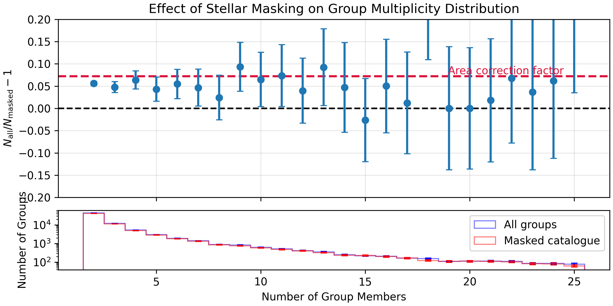

First we examine the effects of the masking on the groups.
This plot is a stacked density plot of 50 random groups in a given N bin. It shows that for groups with a larger N, the area covered by a single given star mask is comparitively smaller than for groups with a smaller N. This for groups ids given in the sharks simulation.

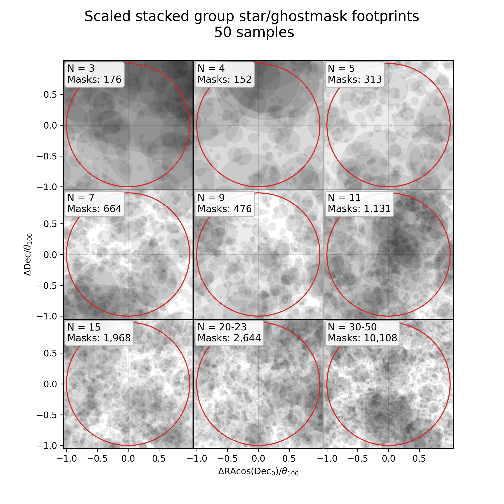

And in terms of the galaxies masked by the sources in the plot above, you get this. Same set up.

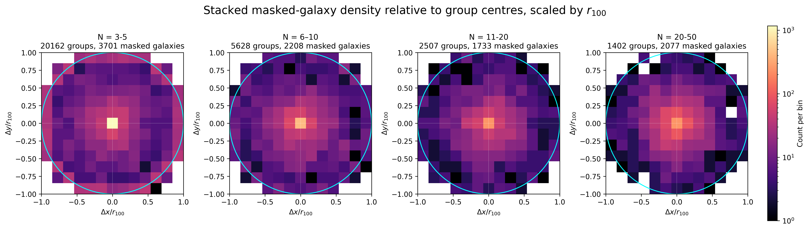

They key take aways from these plots are 
1) Group abundance per N scales generally with footprint area.
2) Bigger groups seem likelier to retain similar properties to their unmasked counterpart. This is because a group with 10 members that looses 7% of its area will on average have 9 members. This 9 member group will still have mostly the same r50, and $\sigma_{gapper}$ as the unmasked group.
3) It is unclear if this effect scales down into the group catalog level, when built with a group finder.

To examine this further, we look at the abundance of derived properties from masked and unmasked groups. In particular, we look at r50 and $\sigma_{gapper}$ as these are use in many mass estimates. This was not extended to the SHMR or LHMR, as you can see in the first plot that larger groups dont loose that much stellar mass. 

Firstly $\sigma_{gapper}$:

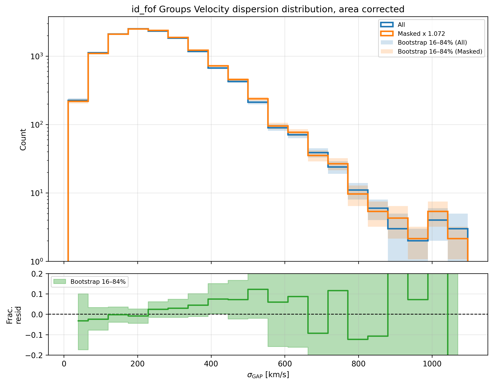

Plot of $\sigma_{gapper}$ abundances. Errors from bootstrapping. Area difference between masked and unmasked is 7.2%. Seems to be systematically higher at at higher velocity dispersions, exactly how we expect. 

Now r50:

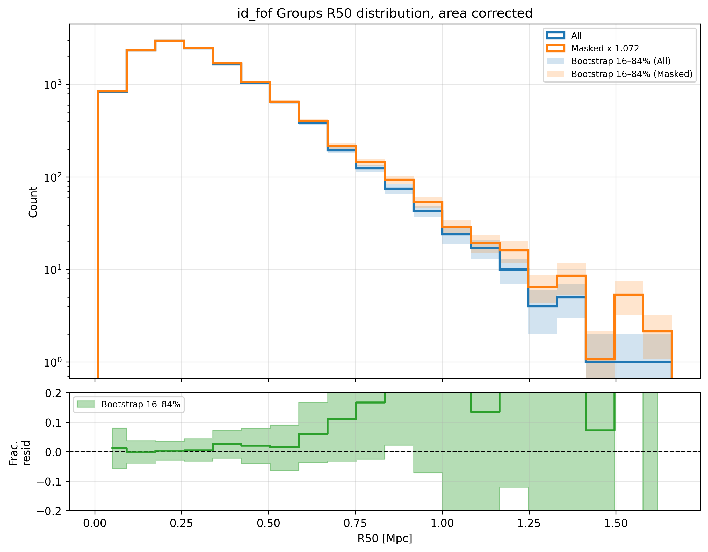

Plot of R50 abundances. Errors from bootstrapping. Area difference between masked and unmasked is 7.2%. As expected, we see r50 go systematically higher at higher values. Although for bins of r50 with less than 100 members the errors increase too much to be meaningful.

And finally we check that this propigates down into the dynamical mass, which it does:

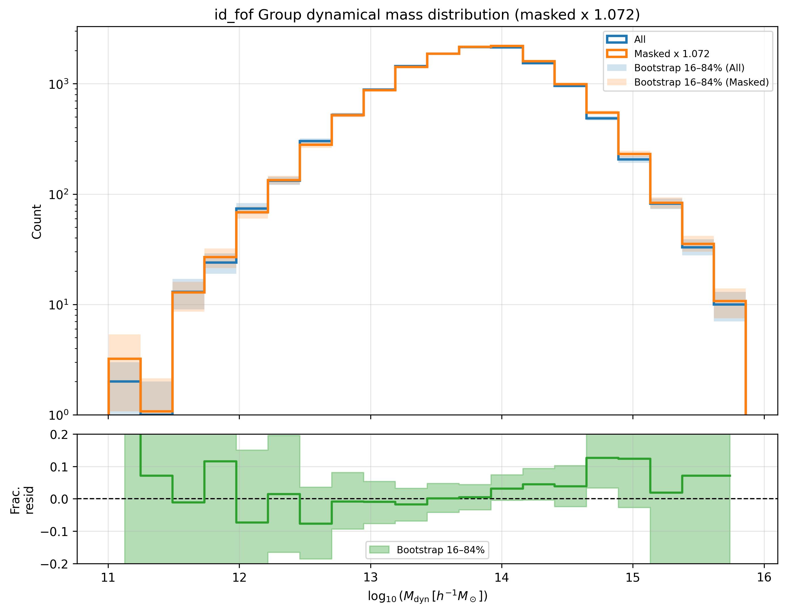

Same as above plots, this time dynamical mass. Still biased at high mass end!

Seems to me like this would cause systematics in any HMF, where your off on the higher mass end by some fraction of what you say.
But, we still need to forward model this using a real groupfinder. 
So, lets do so with these plots again:

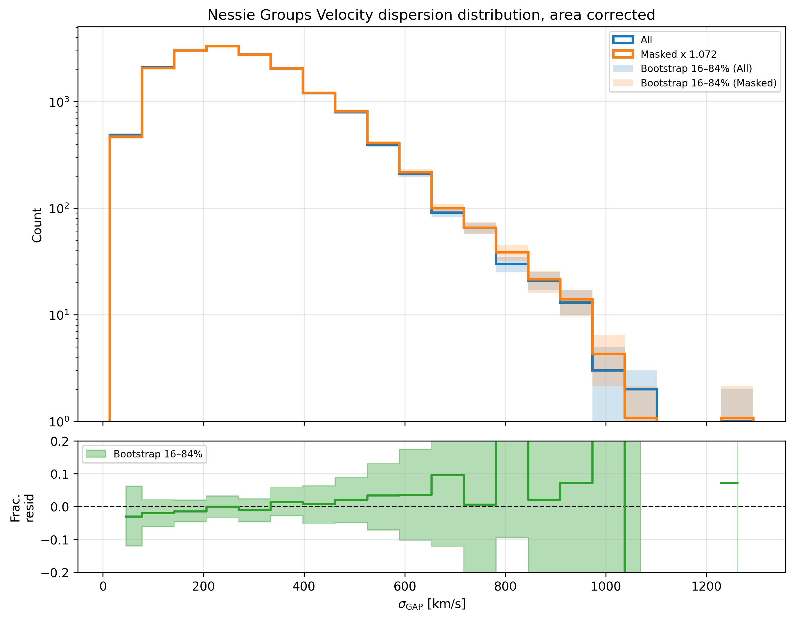

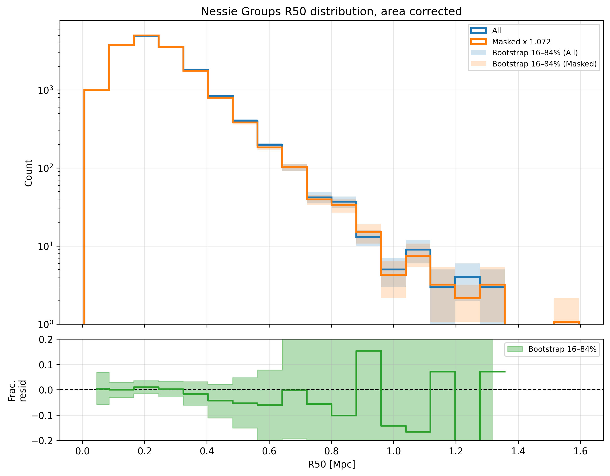

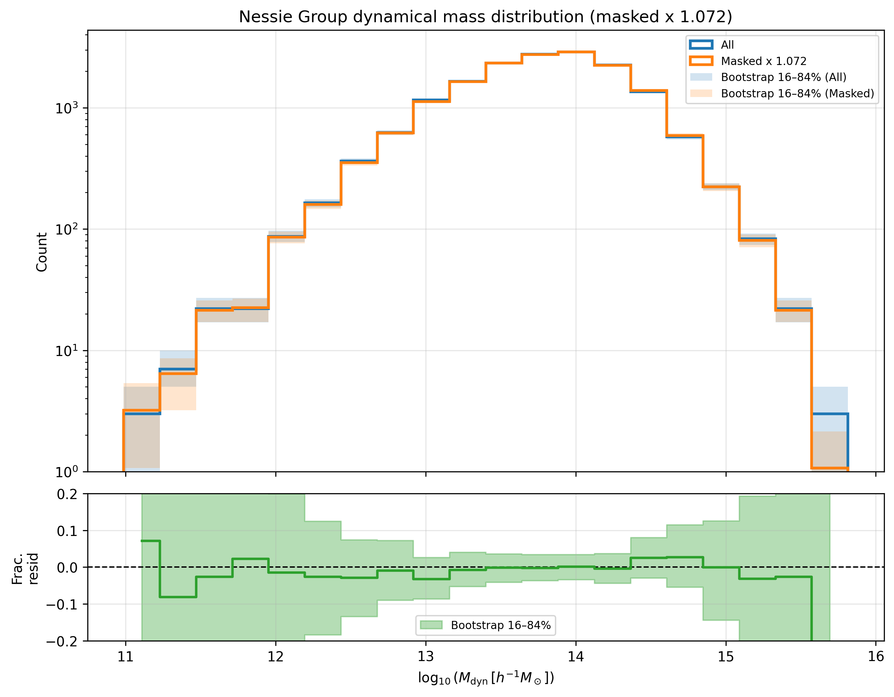

And would you look at that, this whole effect seems to go away. Now, to see why, lets take a look how well nessie recovers its groups from the masked to the unmasked version. Here, we run nessie on the masked and unmasked catalog. We then mask the unmask group ids, to find a S score for these two groups. This is what we get:

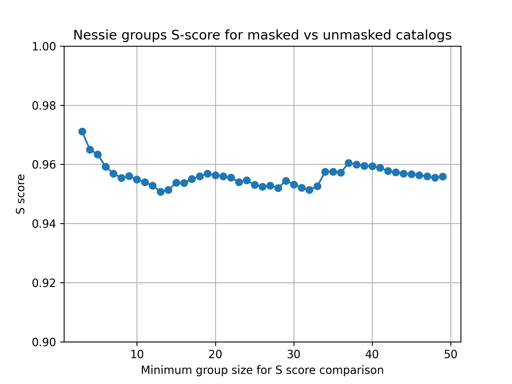

So, as this S score scales ^(1/4) with efficency and purity, what we see is the groups are about 99 percent the same between the group finder run on the masked catalog, and the groupfinder run on the unmasked catalog which then has masked galaxies removed afterwards. So, these two catalogs are basically identical. So, the systamtic offset goes away, and gets washed out by how noisy groupfinding is anyway. 

